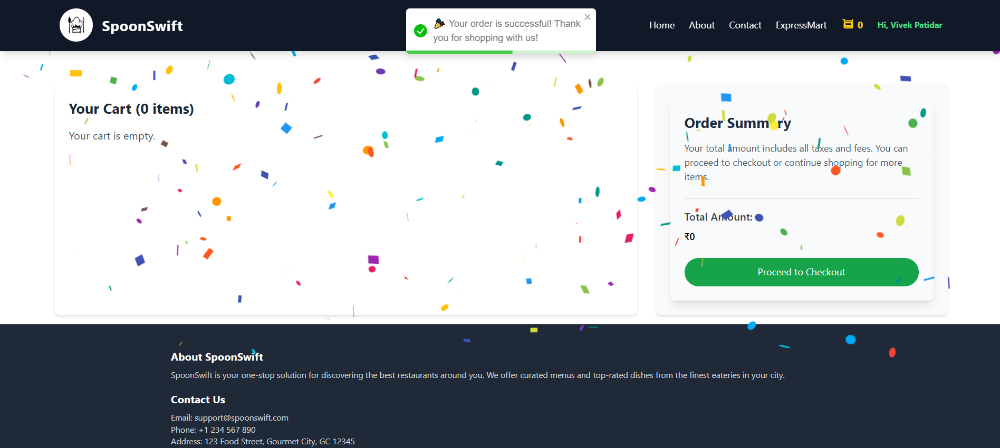

# 🥄 **SpoonSwift**

SpoonSwift is an innovative application designed to bring a seamless and engaging culinary exploration experience. From delicious dish displays in carousels to robust testing setups, this project is a perfect playground for developers experimenting with cutting-edge ReactJS setups, parcel-based bundling, and Tailwind CSS for responsive designs.

## 🌐 Live Demo

SpoonSwift is hosted on **Vercel** — check it out here: [Live Demo](https://spoon-swift.vercel.app)

---

## ✨ **Features**

### 🍽️ **Dish Carousel**

- **Dynamic Displays:** Showcases various dish images in an elegant carousel format.
- **Interactive Experience:** Smooth transitions and user-friendly navigation through dishes.

### 💻 **Developer-Centric Configuration**

- **Parcel Bundler:** Efficiently handles modern JavaScript, JSX, and CSS files with blazing-fast builds.
- **Tailwind CSS:** Provides extensive responsive design utilities to enhance UI adaptability.
- **Custom Utilities:** Includes custom configurations like `no-scrollbar` for clean designs.

### ✅ **Robust Testing Setup**

- **Jest:** Comprehensive test cases ensure application stability and reliability.
- **Testing Library:** User-friendly APIs for DOM testing, enhancing the test coverage and developer confidence.

### 🚀 **Effortless State Management**

- **Redux Toolkit:** Simplifies state management with features like `createSlice`.
- **React Redux:** Seamless integration for managing state across the application.

---

## 🛠️ **Core Components**

### 🎡 **DishCarousel**

- **Dynamic Content:** Displays an array of dishes fetched dynamically from the data source.
- **Smooth Navigation:** Offers a seamless experience when cycling through images.
- **Custom Styling:** Utilizes Tailwind CSS for a visually appealing design.

### 🖥️ **MainContainer**

- **Unified Layout:** Combines carousel and auxiliary components into a cohesive design.
- **Responsive UI:** Tailwind utilities ensure a consistent experience across devices.

### 🏙️ **RestaurantCard**

- **Compact Display:** Presents essential restaurant details such as name, price, and ratings.
- **Dynamic Data:** Fetches and displays restaurant data dynamically.
- **Interactive Elements:** Includes clickable components to navigate to the restaurant's menu.

### 📜 **RestaurantMenu**

- **Comprehensive Layout:** Displays a categorized menu for each restaurant.
- **Dynamic Rendering:** Fetches menu data based on the selected restaurant.
- **Responsive Design:** Optimized for different screen sizes using Tailwind CSS.

### 🍽️ **CategoryItems**

- **Categorized Display:** Presents menu items grouped by categories for easy navigation.
- **Interactive Options:** Allows users to add items to the cart or view items.
- **Dynamic Data:** Renders items based on the selected category.

### 🛒 **Cart**

- **User-Friendly Interface:** Displays selected items, quantities, and total cost.
- **Interactive Management:** Allows users to clear cart.
- **Responsive Design:** Ensures a seamless experience across all device sizes.

### ⚙️ **Custom Utilities in Tailwind**

- **No Scrollbar Utility:** Provides a distraction-free layout by hiding scrollbars for better aesthetics.
- **Extendable Theme:** Offers a flexible approach to add or modify UI elements.

---

## 🚀 **Technologies Used**

| **Frontend** | **Testing**     | **Bundling** | **Styling**        | **State Management** |
| ------------ | --------------- | ------------ | ------------------ | -------------------- |
| React        | Jest            | Parcel       | Tailwind CSS       | Redux Toolkit        |
| React Router | Testing Library | PostCSS      | Custom Tailwind UI | React Redux          |

---

## 🛠️ **Installation and Setup**

### Prerequisites

- Node.js (v16 or higher recommended)
- npm or yarn package manager

### Steps

1. **Clone the Repository:**

   ```bash
   git clone <https://github.com/Vivekpatidar137/SpoonSwift>
   cd SpoonSwift
   ```

2. **Install Dependencies:**

   ```bash
   npm install
   ```

3. **Start the Development Server:**

   ```bash
   npm start
   ```

4. **Run Tests:**

   ```bash
   npm test
   ```

5. **Build for Production:**
   ```bash
   npm run build
   ```

---

## 📂 **File Structure**

```
SpoonSwift/
|-- coverage/
|-- dist/
|-- node_modules/
|-- src/
|   |-- components/
|   |   |-- __mocks__/
|   |   |-- __tests__/
|   |   |   |-- __snapshots__/
|   |   |   |-- Cart.test.jsx
|   |   |-- About.jsx
|   |   |-- Body.jsx
|   |   |-- Cart.jsx
|   |   |-- CategoryItems.jsx
|   |   |-- Contact.jsx
|   |   |-- Error.jsx
|   |   |-- ExpressMart.jsx
|   |   |-- Footer.jsx
|   |   |-- Header.jsx
|   |   |-- RestaurantCard.jsx
|   |   |-- RestaurantCategories.jsx
|   |   |-- RestaurantMenu.jsx
|   |   |-- RestaurantsCarousel.jsx
|   |   |-- Search.jsx
|   |   |-- Shimmer.jsx
|   |-- myAssets/
|   |-- utils/
|-- main.jsx
|-- .babelrc
|-- .gitignore
|-- .parcelrc
|-- postcssrc
|-- babel.config.js
|-- index.html
|-- jest.config.js
|-- package-lock.json
|-- package.json
|-- README.md
|-- style.css
|-- tailwind.config.js
```

---

## 🧪 **Testing**

- **Unit Tests:** Verify individual components with Jest and Testing Library.
- **DOM Interactions:** Ensure smooth user interactions using `@testing-library/react`.

### Running Tests

```bash
npm test
```

Use the `watch-test` script for continuous testing during development:

```bash
npm run watch-test
```

---

## ❤️ **Acknowledgments**

Special thanks to:

- [Tailwind CSS](https://tailwindcss.com/) for providing a responsive design framework.
- [Jest](https://jestjs.io/) for robust testing.
- [Parcel](https://parceljs.org/) for efficient bundling.

---

## 🎯 Screenshots

### Main Page

#### 🍽️ Dish Carousel and 🪶 Header


#### 🏬 Restaurants


### 📜 RestaurantMenu

#### 🍽️📄 Menu page


#### 🔽🔼 Accordion


### 🛒 Cart




### 📱 Mobile View


Made with ❤️ by Vivek Patidar.
